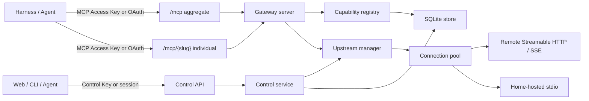

# ToolHome architecture

ToolHome 是单进程模块化单体。控制面、数据面、上游连接和持久化在代码层解耦，但首版不引入消息队列或额外基础设施。

## Modules

- `src/control`：Control API、OpenAPI、业务服务与 CLI client。
- `src/data-plane`：聚合/独立 MCP Server、路由、虚拟化与 HTTP serving。
- `src/upstream`：协议 Client、连接池、OAuth provider、扩展 transport bridge。
- `src/security`：两类 API Key、SecretBox、控制台 session 与下游 OAuth Authorization Server。
- `src/storage`：同步 SQLite repository，WAL、外键、加密 payload 与主密钥一致性标记。
- `web`：标准 Vite React 控制台，使用 Radix UI primitives 与 Lucide icons。

## 两个身份域

Control API Key 只能访问 `/api/v1/*`。MCP Access API Key 只能访问 `/mcp` 与 `/mcp/{slug}`。两类 Key 使用不同前缀、不同数据库 kind 和不同认证入口，不能互换。

MCP 数据面还充当 OAuth 2.1 Protected Resource。每个 endpoint 是独立 audience：

- `{public_url}/mcp`
- `{public_url}/mcp/{slug}`

Authorization Server metadata、Protected Resource metadata、DCR、Authorization Code + PKCE 与 token endpoint 由 `OAuthServer` 提供。

DCR 不维护易丢失的进程内 client registry。注册 metadata 被编码进带版本的 Client ID，并用由主密钥派生的 HMAC 签名，因此同一部署重启后仍可验证。URL-based Client Metadata 只允许 HTTPS 非根路径；连接固定到已校验的公网解析地址，并约束重定向和响应体大小，避免 DNS rebinding 把请求切换到内网。

## 上游连接

每个 Server 按下游 `ClientCapabilities` profile 建立连接池，避免把一个 Harness 的 Roots、Sampling、Elicitation 或扩展声明泄露给另一个能力 profile。连接数由 Server 的 `maxConcurrency` 限制。

远程连接优先 Streamable HTTP。只有配置 `allowSseFallback` 时才尝试旧 SSE。Home-hosted 连接由 stdio transport 启动，环境变量由系统默认、transport env 和 Environment Credential 合并。

协议模式：

- `auto`：先 `server/discover`，不支持时退回 2025 `initialize`。
- `modern`：固定 2026-07-28。
- `legacy`：固定 2025-era。

下游按协议时代使用两条隔离的数据面：2026-07-28 由 per-request handler 无状态处理；2025-era 使用带 `Mcp-Session-Id` 的 stateful Streamable HTTP。Legacy Session 保留 initialize 中的 ClientCapabilities，使 Sampling、Roots、Elicitation、日志和私有 server-to-client request 在后续调用中仍可用。Session 与 Access/OAuth principal 绑定，最多保留 256 条，空闲 24 小时后回收。

## 聚合与独立入口

独立入口不改上游名称和 URI，适合 MCP Apps、同名工具、私有扩展或任何要求精确上游语义的 Harness。

聚合入口执行以下可逆映射：

- Tool / Prompt：`{slug}.{name}`。
- Resource：`toolhome://{slug}/resource/{encoded}`。
- MCP App Resource：`ui://toolhome/{slug}/resource/{encoded}`，保留 `ui://` scheme。
- Resource Template：编码原始 RFC 6570 template，并重新暴露变量。
- Task ID：`toolhome-task:{slug}:{encoded}`。
- 未知扩展 method：`toolhome/{slug}/{method}`。

资源内容中的 resource link、embedded resource 和 MCP Apps metadata 使用同一映射。调用时反向解析，再发送给对应 upstream。

## 动态能力

SQLite 中的 capability snapshot 用于快速发现和运行状态，不作为调用时的唯一事实。Gateway 在下游 list/call 时按该请求的 ClientCapabilities 从上游读取实时 catalog，再做聚合分页。这样 capability-sensitive MCP Apps 或动态 tools 不会被旧快照隐藏。

聚合分页使用带签名的 cursor，绑定结果 fingerprint；catalog 变化后旧 cursor 会被拒绝，避免跨版本错页。

## OAuth/OIDC upstream client

上游 OAuth Credential 是持久化的 `OAuthClientProvider`：

- 发现状态、PKCE verifier、state、client information 和 token 全部进入加密 payload。
- HTTPS 部署优先暴露 URL-based Client Metadata；不支持时由官方 SDK 走 DCR。
- callback 在兑换 code 前验证 state、过期时间、发现 issuer 与 RFC 9207 `iss`。
- transport 401 由官方 provider 自动刷新或产生新的授权 URL。
- 撤销先尝试 RFC 7009 endpoint，再清除本地 token。

OAuth token 与 protected resource 绑定，因此一个 OAuth Credential 只能关联一个 Remote Server。

## 扩展桥

官方 TypeScript SDK 2.0.0 尚未为最终 Tasks extension 提供完整高阶 API。ToolHome 在 transport 层补一个小型、隔离的 JSON-RPC requester：

- 仅对 modern `tasks/get`、`tasks/update`、`tasks/cancel` 绕过旧 method registry。
- 写入完整 2026 request envelope。
- 绑定下游取消和超时。
- 按 SEP 要求发送与 `taskId` 一致的 `Mcp-Name` header。
- 不改变其他 SDK 请求路径。

Tool call 返回 task result 时，transport 暂时把 SDK 当前无法解码的 result 包装为合法 complete result；Gateway 随即恢复原始 task result。这个兼容层只存在于 adapter 内部。

SDK 2.0.0 的 2026 核心 registry 仍会把同名的 2025 Tasks 方法判定为已删除，而不是交给 extension fallback。数据面只对已声明 Tasks extension 的三个控制方法做内部 method 适配，对外 wire method 仍严格保持 `tasks/get`、`tasks/update`、`tasks/cancel`，并继续执行 `Mcp-Method`、`Mcp-Name` 与 body 交叉校验。

旧式上游到现代 Harness 的交互请求由另一个有界 bridge 处理。它只在 `tools/call`、`prompts/get`、`resources/read` 上启用，暂停原始上游调用并把 Elicitation、Sampling、Roots 收集成 MRTR `input_required`。连接重启、下游取消和总超时都会清理 suspended round，不会让连接槽永久占用。

## 故障与生命周期

Server runtime state 记录协议版本、状态、进程 ID、最近成功、最近错误和重启计数。Manager 将认证错误标为 `auth-required`，连接错误标为 `unreachable`。Home-hosted stdio 意外退出时，Manager 按 restart policy 重建进程；主动重启、配置更新、Credential 变化和删除都会关闭旧 adapter、订阅与 suspended round，下一次请求使用新连接。

事件写入 SQLite 并由触发器保留最近约 10,000 条。Home-hosted stderr 会先按 transport env 与 Environment Credential 值脱敏。配置备份默认脱敏；显式 secret export 是可恢复的便携格式，导入在单个数据库事务内完成 ID 重映射。

应用收到 SIGINT/SIGTERM 后并行停止 HTTP 接收与 MCP runtime，随后关闭 upstream clients 和 SQLite，避免长连接阻塞退出。`/healthz` 表示进程存活；`/readyz` 在诊断状态不健康时返回 `503`。Web 静态资源按构建产物相对路径解析，不依赖启动时工作目录。
